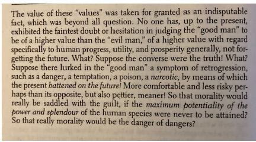

---
output:
  html_document:
    keep_md: true
---

# Week 4 - Egoism, Altruism, and the Social Contract

Instead of the typical LO questions, I want you to play the game that is below. Record your responses, for instance, say what the scenario was (homeless drug addict vs. millionaire etc). After each scenario, there is a blurb that displays below saying the number of people who also made the same or alternate choice as you. Make sure that you also record this in your homework response.

<embed type="text/html" src="https://trolleyproblem.io/" width="800" height="800">

## LOs

* Describe differences between descriptive (psychological) egoism and ethical egoism
* Define altruism, empathy, compassion and love
* Explain criticisms of altruism and the importance of reciprocal altruism
* Explain the challenge posed by the prisoner's dilemma
* Describe how the social contract provides a solution to problems of egoism
* Discuss how egoism is connected to laissez-faire capitalism and economics
* Evaluate the conflict between impartialiaty, egoism, and care
* Defend your own ideas about egoism, altruism, and the social contract

### Empathy, Compassion, and Love
### The Debate about Egoism and Altruism

## Psychological Egoism

* What Is Psychological Egoism?

* Is Psychological Egoism True?

## Ethical Egoism

* What Is Ethical Egoism?
* Is Ethical Egoism a Good Theory?

### Rand's Objectivist Ethics[@rand64]

## The Prisoner’s Dilemma

* The Social Contract

* Connections with Economic Theory

## Impartiality, Egoism, and Care

* Care Ethics and the Challenge of Impartiality

* Why Be Moral?

## Chapter Summary

## Primary Source Readings

* Reading 4-1: The Ring of Gyges
* Reading 4-2: Self-Love
* Reading 4-3: Altruism in Nature
* Reading 4-4: Egoism, Altruism, and Care

## Review Exercises

Friedrich Nietzsche[@niet03] offers what many assume to be a criticism of altruism. It is actually one of the more significant criticisms of altruism in philosophical literature. One of the more nuanced and complex arguments.

### First he takes issue with what he calls conflict betweens instinct of self preservation and selfishness, and our more pro-social emotions.

### What happens when we suppress our initial pro-social inclinations?

{width=100%}

{width=100%}
